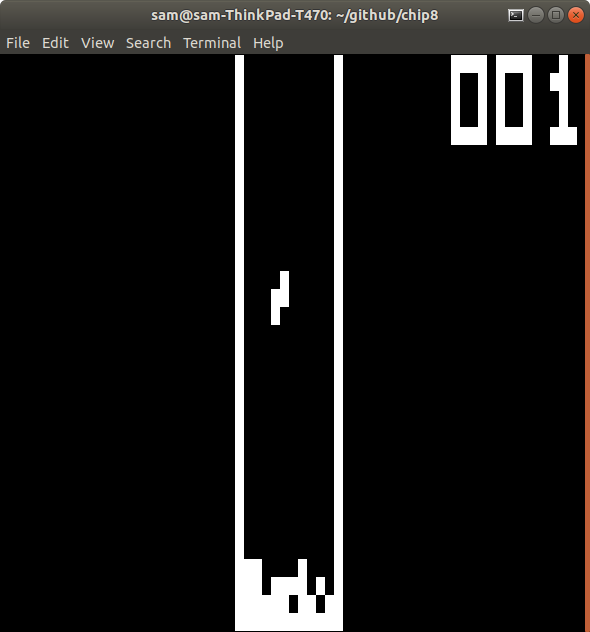
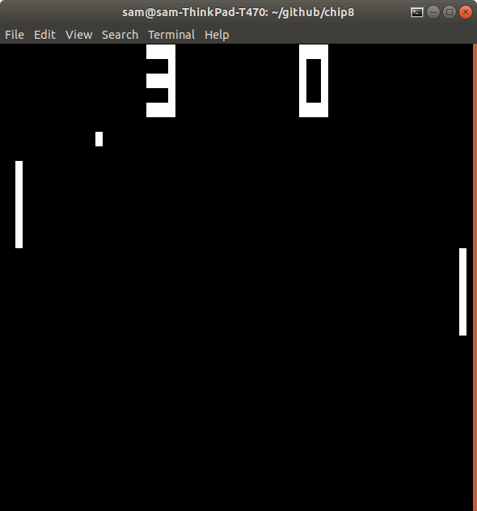
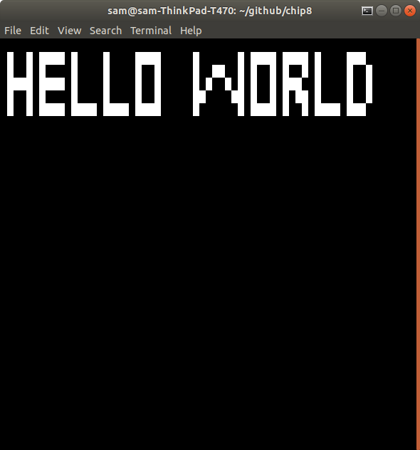

# Chip-8 emulator

* 8-bit emulator written in C using ncurses for terminal display
* Used multiple threads for implementing timers and reading keyboard input
* Can run pre-existing Chip-8 programs

Chip-8 emulator running another game

Chip-8 emulator running a game

Chip-8 emulator running a hello world program

Only tested in Ubuntu, and on a laptop

Run makefile first, then run with sudo ./chip8 romName.ch8

The makefile will resize the terminal, run make clean to revert back to default
terminal size and delete the compiled program.  Run make reg to resize the emulator to allow the registers to be shown on screen.

## command line arguments

reg: makes register visible, requires make reg to be seen

step: enables step mode, breaks programs that requires key presses

log: outputs all instructions to a log.txt file, requires reg

delay=x: x is time in nanoseconds to wait after each instruction is processed, defaults to 1250000

sudo is required because the file platform-i8042-serio-0-event-kbd from /dev/input/by-path/ is read to tell if a key is being held down

## Chip-8 assembler
Run with python assembler.py filename.txt
Will convert txt files to Chip-8 roms
